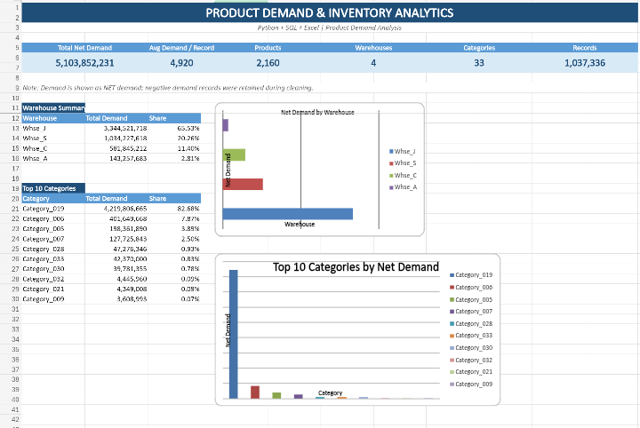

# Product Demand & Inventory Analysis

## Overview

Analysis of historical product demand to identify demand patterns, high-demand products, key warehouses, and category-level demand concentration.

## Dataset

[Kaggle — Historical Product Demand](https://www.kaggle.com/datasets/felixzhao/productdemandforecasting)

## Tools & Techniques

- **Python:** Pandas for data cleaning, date handling, EDA, grouping and trend analysis.
- **SQL:** SQLite queries using `GROUP BY`, aggregations, window functions and demand-share calculations.
- **Excel:** Dashboard with KPI cards, charts and summary tables for demand, warehouses, categories and products.

## Key Business Questions

- Which categories and warehouses contribute the most demand?
- Which products have the highest demand?
- How does demand change over time?
- Which products are most important within each warehouse?

## Key Insights

- Category_019 contributes **82.68%** of total net demand.
- Whse_J contributes **65.53%** of total net demand.
- Product_1359 has the highest overall net demand at approximately **470.71M**.
- **2015** recorded the highest full-year net demand among 2012–2016.

## Workflow

**Kaggle Dataset → Python Cleaning & EDA → SQL Analysis → Excel Dashboard**
